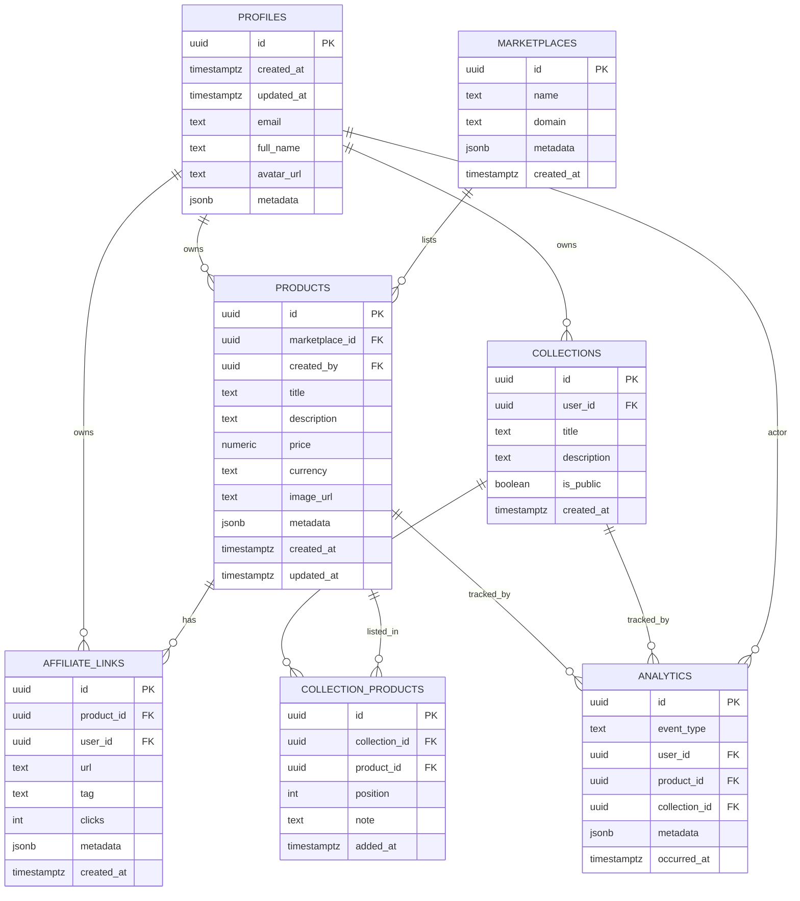

# Favoria - Database Reference

Last Updated: 2026-08-03

This document is the single source of truth for Favoria's Supabase/Postgres schema, RLS policies, indexing strategy, naming conventions, seed data, and migration/backup guidance.

## Database Overview

- Engine: Supabase (Postgres)
- Primary keys: UUID (`uuid_generate_v4()`)
- Row Level Security: enabled (RLS)
- Timestamps: `created_at TIMESTAMPTZ DEFAULT now()`, `updated_at TIMESTAMPTZ`
- JSON columns for flexible metadata: `jsonb`

## ER Diagram (Mermaid)

## Tables

Below are the core tables. For each table we document purpose, columns, types, constraints, defaults, indexes, and foreign keys.

### 1. `profiles`

- Purpose: store user profile data mapped to Supabase Auth `auth.users` (one-to-one).
- Columns:
  - `id UUID PRIMARY KEY` — set to `auth.uid()` on insert
  - `email TEXT UNIQUE NOT NULL`
  - `full_name TEXT`
  - `avatar_url TEXT`
  - `metadata JSONB`
  - `created_at TIMESTAMPTZ DEFAULT now()`
  - `updated_at TIMESTAMPTZ`
- Indexes: `idx_profiles_email (email)`
- RLS/FK: referenced by `products.created_by`, `collections.user_id`, `affiliate_links.user_id`, `analytics.user_id`

### 2. `marketplaces`

- Purpose: canonical list of marketplaces (Amazon, Shopee, dll.). Public data.
- Columns:
  - `id UUID PRIMARY KEY`
  - `name TEXT NOT NULL`
  - `domain TEXT`
  - `external_id TEXT` (id used by marketplace APIs)
  - `metadata JSONB`
  - `created_at TIMESTAMPTZ DEFAULT now()`
- Indexes: `idx_marketplaces_name (lower(name))`
- Visibility: SELECT may be public; mutations restricted to admins/service roles.

### 3. `products`

- Purpose: store product metadata added/imported from marketplaces or user-curated items.
- Columns:
  - `id UUID PRIMARY KEY`
  - `marketplace_id UUID REFERENCES marketplaces(id)`
  - `created_by UUID REFERENCES profiles(id) NULL` — user who added/curated the product
  - `title TEXT NOT NULL`
  - `description TEXT`
  - `price NUMERIC` — store decimal prices
  - `currency TEXT` — ISO code
  - `image_url TEXT`
  - `tags TEXT[]` — denormalized tags for quick filter
  - `metadata JSONB`
  - `created_at TIMESTAMPTZ DEFAULT now()`
  - `updated_at TIMESTAMPTZ`
- Indexes:
  - `idx_products_marketplace_id (marketplace_id)`
  - `idx_products_created_by (created_by)`
  - `idx_products_title_gin (to_tsvector('english', title))` for full-text search
  - `idx_products_tags_gin USING gin (tags)`
- Notes: product records can be reused across users; `created_by` nullable allows marketplace-only items.

### 4. `affiliate_links`

- Purpose: store user-specific affiliate links for products.
- Columns:
  - `id UUID PRIMARY KEY`
  - `product_id UUID REFERENCES products(id) NOT NULL`
  - `user_id UUID REFERENCES profiles(id) NOT NULL` — owner of the affiliate link
  - `url TEXT NOT NULL`
  - `tag TEXT` — optional label
  - `clicks INTEGER DEFAULT 0`
  - `metadata JSONB`
  - `created_at TIMESTAMPTZ DEFAULT now()`
- Indexes: `idx_affiliate_links_user_id`, `idx_affiliate_links_product_id`

### 5. `collections`

- Purpose: user-curated collections of products to share or publish.
- Columns:
  - `id UUID PRIMARY KEY`
  - `user_id UUID REFERENCES profiles(id) NOT NULL`
  - `title TEXT NOT NULL`
  - `description TEXT`
  - `is_public BOOLEAN DEFAULT false`
  - `metadata JSONB`
  - `created_at TIMESTAMPTZ DEFAULT now()`
- Indexes: `idx_collections_user_id`, `idx_collections_is_public`

### 6. `collection_products` (pivot)

- Purpose: join table to allow many-to-many between `collections` and `products`.
- Columns:
  - `id UUID PRIMARY KEY`
  - `collection_id UUID REFERENCES collections(id) NOT NULL`
  - `product_id UUID REFERENCES products(id) NOT NULL`
  - `position INTEGER DEFAULT 0` — ordering within a collection
  - `note TEXT` — optional curator note
  - `added_at TIMESTAMPTZ DEFAULT now()`
- Indexes: composite index on `(collection_id, position)`; `idx_collection_products_product_id`

### 7. `analytics`

- Purpose: capture events for basic analytics (clicks, views, shares).
- Columns:
  - `id UUID PRIMARY KEY`
  - `event_type TEXT NOT NULL` — e.g., `product_view`, `link_click`
  - `user_id UUID NULL REFERENCES profiles(id)` — actor (nullable for anonymous)
  - `product_id UUID NULL REFERENCES products(id)`
  - `collection_id UUID NULL REFERENCES collections(id)`
  - `metadata JSONB` — event details (source, ip hashed, user_agent)
  - `occurred_at TIMESTAMPTZ DEFAULT now()`
- Indexes: `idx_analytics_event_type`, `idx_analytics_product_id`, `idx_analytics_occurred_at`

## Relationships

- One-to-many: `profiles` → `products` (created_by)
- One-to-many: `marketplaces` → `products`
- Many-to-many: `collections` ↔ `products` via `collection_products`
- One-to-many: `products` → `affiliate_links`
- Analytics references many entities (polymorphic usage via nullable FKs)

## Row Level Security (RLS)

General rule: all user-owned data is private by default. Admin/service roles and explicit public tables (like `marketplaces`) are exceptions.

Policy templates (human-readable):

- `profiles`:
  - SELECT: allow user to SELECT their own profile (`auth.uid() = id`)
  - INSERT: allow when `auth.uid() = new.id` or via signup triggers
  - UPDATE: allow when `auth.uid() = id`
  - DELETE: admin-only (rare)

- `marketplaces`:
  - SELECT: public
  - INSERT/UPDATE/DELETE: admin/service role only

- `products`:
  - SELECT: public for marketplace products; private for user-curated fields — recommend separating public product view vs private fields. Alternatively: allow SELECT when `created_by = auth.uid()` or product is marketplace-owned.
  - INSERT: authenticated users
  - UPDATE/DELETE: owner-only (`created_by = auth.uid()`) or admin

- `affiliate_links`:
  - SELECT/UPDATE/DELETE: owner-only (`user_id = auth.uid()`)
  - INSERT: authenticated users (ensure `user_id = auth.uid()`)

- `collections` and `collection_products`:
  - SELECT: if `is_public = true` OR `user_id = auth.uid()`
  - INSERT: authenticated users
  - UPDATE/DELETE: owner-only

- `analytics`:
  - INSERT: allow public insert for event collection endpoints (server should validate and sanitize)
  - SELECT: owner or admin for user-scoped analytics; aggregate analytics may be exposed to owners via server endpoints

Implementation notes:

- Use Postgres policies referencing `auth.uid()` and also consider `current_setting('request.jwt.claims')` if using service roles.
- Prefer per-table policy functions to centralize logic where complexity grows.

## Indexing Strategy

- Index `user_id` columns for quick owner lookups.
- Index `marketplace_id` on `products`.
- Use GIN full-text index on `title` and `description` for product search: `to_tsvector('english', title || ' ' || description)`.
- Use GIN index for `tags` (`text[]`) and for `metadata` JSONB path queries if frequently queried.
- Add composite indexes for common queries (e.g., `(user_id, created_at)`).

## Naming Convention

- Tables: plural, snake_case (e.g., `products`, `affiliate_links`).
- Columns: snake_case (e.g., `created_at`, `marketplace_id`).
- Primary key: `id` (UUID).
- Foreign key columns: `{referenced_table}_id` (e.g., `product_id`).
- Indexes: `idx_{table}_{column}` or `idx_{table}_{col1}_{col2}`.
- Unique constraints: `uq_{table}_{column}`.
- Foreign key constraints: `fk_{table}_{referenced}`.

## Seed Data

Default marketplaces to seed for MVP:

- Benable
- Amazon
- Shopee
- TikTok Shop
- Lazada
- Etsy
- Gumroad

Seed only non-sensitive public fields (name, domain, external_id).

## Migration Strategy

- Use Supabase migrations or a tracked `migrations/` directory committed to repo.
- Each migration: small, reversible when possible, with clear name and timestamp.
- Migration process: branch → create migration → PR with schema diff → CI runs tests → merge and apply migration to staging → verify → deploy to production.

## Backup Strategy

- Use Supabase automated backups and retention policies.
- In addition, schedule periodic `pg_dump` exports to secure storage (encrypted). Keep at least daily backups for 30 days.
- Test restore procedure quarterly.

## Future Tables (Out of MVP)

- `prompt_assets`
- `workflows`
- `ai_models`
- `prompt_categories`
- `prompt_tags`
- `asset_downloads`

## Notes & Decisions

- We include `collection_products` now to support many-to-many collections without costly migrations later.
- Keep analytics events append-only; aggregate via read-side views or materialized views.

---

If you want, I can also generate a suggested SQL migration file (separate step) for this schema; currently this document intentionally does not include SQL.
